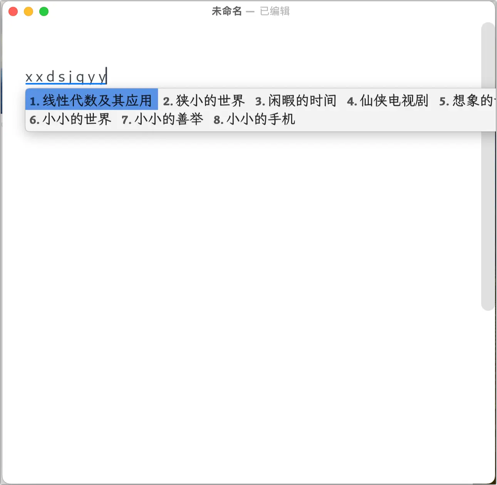

# Hello，Rime

各位老友们好，我是 Chlorine。

今天咱们讲输入法。说起输入法，大家会想到什么呢？搜狗，讯飞，百度，QQ，还是系统原生？

就我个人而言，我在 Windows + Android 的时候一直在用讯飞输入法，感觉尚可。后来换到苹果全家桶，就改 iOS + macOS 原生了。不过，这一对对中文的支持，你别说，你还真别说（）。而且，无论上面的哪种输入法，都不可避免地面临着一些问题：广告，隐私，可定制性，等等。

于是，我需要一个自由的，安全的，高度可定制的输入法。众所周知，世界上满足这些条件的东西，几乎都是 open-source 的。而世界上的确有 open-source 的输入法，隆重请出我们今天的主角—— **Rime** 。

## What is Rime？

Cambridge dictionary 对「rime」 的定义是：

> Frost (= the thin, white layer of ice that forms when the air temperature is below the freezing point of water, especially outside at night)

简单来说：霜。结合 Rime 后续一些组件的命名，我们可以称其为「清霜」。

> 腾蛟起凤，孟学士之词宗；紫电清霜，王将军之武库。

[Rime 的官方网站](https://rime.im/) 则自我介绍道：

> 聪明的输入法懂我心意

严格来说，Rime 并不是输入法，而是「输入算法」或者说是「输入引擎」。它将输入法底层的配置提取出来，并编写为一系列的代码。我们可以通过修改 Rime 的资源库进行多种多样的自定义。这赋予了 Rime 极高的自由度，当然，还有极高的上手难度。

可能有老友和我一样，看到 Rime 的时候会吃一惊：这种东西也能开源？！

众所周知，开源社区是无所不能的，就算是操作系统，都有开源的（例如 Linux），更别提一个输入法了 🤣

Rime 支持全平台（Windows/macOS/Linux/iOS/Android），在不同的平台上有不同的程序，以桌面端为例：

- Linux：「中州韵」（Rime）[^1]
- Windows：「小狼毫」（Weasel）
- MacOS：「鼠须管」（Squirrel）

这几个程序的名字还都挺好听的。

我们下面以 macOS 的「鼠须管」为例进行讲解。

## 安装「鼠须管」

在官网上直接下载即可，是一个 `.pkg` 包。

双击会显示无法打开，不要急，右键——打开方式——安装器，直接无视警告强行打开即可。

安装后，在状态栏的输入法中，找到「鼠须管」启用即可。

## 自定义配置

下面才是 Rime 的重头戏。我目前懂得不多，先说几个我弄的。

> 在任何调整过后，请点击状态栏-鼠须管图标-重新部署！

### 照抄

没错，第一步是当 CV 工程师（逃）

Rime 从头配置实在太复杂了，我们捡一个前人的配置魔改更好。

我用的是 [这个方案](https://github.com/Lucius-Wang/rime-config)。其中的词库似乎挺久没更新了，我们去词库作者 [雾凇拼音](https://github.com/iDvel/rime-ice) 掏最新版词库。具体方法可以参照方案作者的 README。

### 几个键位调整

键位的调整位于 Rime 资源库（macOS 一般是在 `/User/<your-user-name>/Library/Rime`）中的 `default.yaml`，这是 Rime 最关键的配置文件。

我已经习惯使用 macOS 的中英键而非 shift 切换输入法了，我们找到键位部分，改掉 shift-L：

```YAML
Shift_L: noop  # commit_code | commit_text | inline_ascii | clear | noop
```

由于 Rime 自带进入特定程序切换输入法的功能，因此我们将右边的 shift 置为切换，以备不时之需，例如在 VS Code 中写中文注释。

> 注：对于 YAML 的修改，Rime 官方推荐使用 patch，具体见 [CustomizationGuide · rime/home Wiki (github.com)](https://github.com/rime/home/wiki/CustomizationGuide)。

### 自定义短语

本方案的自定义短语在 `custom_phrase.txt` 中，按照 `汉字<Tab>编码<Tab>权重` 添加即可。例如我添加了几个：

```plain
计金班  jjb 3
计金    jj  2
针班    zb  2
计算机与金融    jsjyjr  1
无系    wx  2
电子工程系  wx  3
叉院    chay    3
交叉信息研究院  chay    4
贡系    gx  3
经济管理学院    gx  4
雷系    lx  3
自动化系    lx  3
三字班  szb 2
行健书院    xjsy    1
日新书院    rxsy    1
探微书院    twsy    1
致理书院    zlsy    1
求真书院    qzsy    1
秀钟书院    xzsy    1
未央书院    wysy    1
```

理论上应该会有自定义的 `dict.yaml` 的，但是我没找到。

### 外观

本方案自带了 macOS 风格的输入法，但是我觉得不够 mac。在 `squirrel.custom.yaml` 中，将 mac 主题的 `hilited_corner_radius` 改成 0 会比较接近 macOS Sonoma 的风格。

当然你也可以像我一样自己写。App Store 上有一个 Squirrel designer 软件，可以帮你设计皮肤。

我自己随便写了一个：

```YAML
Like:
      name: Like
      author: Chlorine
      font_face: "LXGWWenKaiLite-Regular"
      font_point: 18.0
      label_font_face: "Bookerly-Bold"
      label_font_point: 15.5
      candidate_list_layout: linear
      text_orientation: horizontal
      inline_preedit: true
      translucency: true
      mutual_exclusive: true
      corner_radius: 5.0
      hilited_corner_radius: 5.0
      line_spacing: 2.0
      alpha: 10.0
      color_space: display_p3
      back_color: 0xF2F3F3
      candidate_text_color: 0xD8000000
      comment_text_color: 0x3F000000
      label_color: 0x515151
      hilited_candidate_back_color: 0xCDDC7944
      hilited_candidate_text_color: 0xD8000000
      hilited_comment_text_color: 0x000000
      hilited_candidate_label_color: 0xEE492816
      hilited_corner_radius: 0
      text_color: 0x3F000000
      hilited_text_color: 0xD8000000
      composition_bar_height: 35.0
```

需要电脑上有霞鹜文楷便携版的字体，没有的话可以换或者自己安装。效果如下，还算过得去吧。



夜间模式需要在第 64 行的 `style` 下面添加一行：

```YAML
color_scheme_dark: <你的主题名称>
```

这是我的夜间模式代码。

```YAML
NightMode:
      name: NightMode
      author: Chlorine
      font_face: "LXGWWenKaiLite-Regular"
      font_point: 18.0
      label_font_face: "Bookerly-Bold"
      label_font_point: 15.5
      candidate_list_layout: linear
      text_orientation: horizontal
      inline_preedit: true
      translucency: true
      mutual_exclusive: true
      corner_radius: 5.0
      hilited_corner_radius: 5.0
      line_spacing: 2.0
      alpha: 10.0
      color_space: display_p3
      back_color: 0x1E1E1E
      candidate_text_color: 0xFFFFFFFF
      comment_text_color: 0x7F7F7F
      label_color: 0xFFD3D3D3
      hilited_candidate_back_color: 0xCDDC7944
      hilited_candidate_text_color: 0xFFFFFFFF
      hilited_comment_text_color: 0x000000
      hilited_candidate_label_color: 0xFFD3D3D3
      hilited_text_color: 0xD8000000
      composition_bar_height: 35.0
```

### 自动中英文切换

同样是在 `squirrel.custom.yaml` 中。第 6 行开始都是，按照上面的格式照抄即可。

---

今天先讲这么多吧，我写微积分去了。

[^1]: Rime 输入法本身也被称为「中州韵」。我们约定在提到中州韵的时候，都指的是其 Linux 版本。
